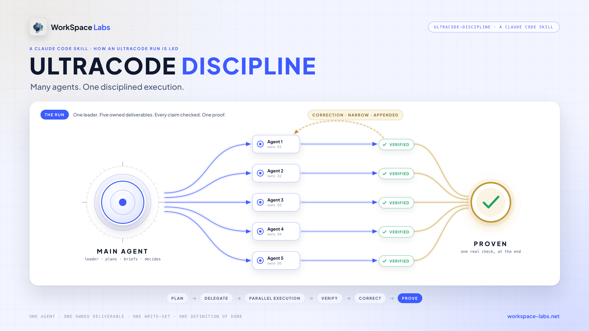
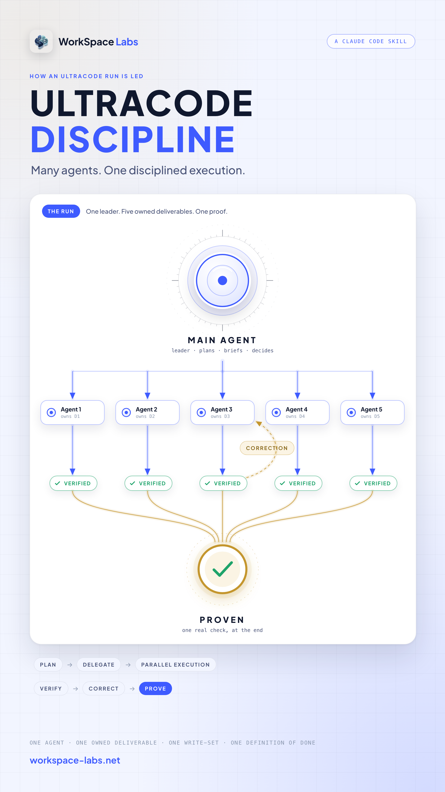

# ultracode-discipline



**Disciplined multi-agent execution for Claude UltraCode.**

UltraCode lets Claude Code put many agents on one task. This skill is the small governance layer that keeps the main agent in charge of the run: it splits the work into owned deliverables, fixes the contracts before any agent starts, takes no result without evidence, has every claim checked by an agent that did not do the work, and corrects narrowly instead of starting over. It changes how Claude leads. It does not replace UltraCode or the Workflow engine.

The skill is one file — [`skills/ultracode-discipline/SKILL.md`](skills/ultracode-discipline/SKILL.md). **Claude Code only.**

---

## What it does

A fan-out is only as disciplined as the prompt that started it. With this skill loaded, the main agent leads every run the same way:

- it scouts once and gives every agent the same facts;
- it splits the task into owned deliverables, each with its own write-set and its own definition of done;
- it fixes interfaces, names and shapes before any agent starts, and no agent may change them;
- every agent returns a structured result with evidence, and a missing result is reported as a failure, never dropped;
- every claim is checked by an agent that did not do the work;
- a failed check gets a narrow, bounded correction, not a new run;
- the leader runs the project's real test, build or check once at the end.

---

## The workflow

`SCOUT → DECOMPOSE → CONTRACT → BRIEF → RUN → VERIFY → PATCH → PROVE`

| Step | What the main agent does |
|---|---|
| **SCOUT** | Gathers the facts every agent needs, once: inline or with one read-only agent. |
| **DECOMPOSE** | Lists the owned deliverables, each with its write-set. |
| **CONTRACT** | Fixes the interfaces, names and shapes before anyone starts. |
| **BRIEF** | Writes every prompt complete, with its schema and its verifier stage. |
| **RUN** | Launches, then continues without polling. |
| **VERIFY** | Checks every claim in the run, per deliverable, and surfaces every missing result. |
| **PATCH** | Corrects narrowly, appended, bounded. |
| **PROVE** | Runs the real project command once and reports with evidence. |

Verification and correction happen inside the run, per deliverable. The leader's own review and patch happen between runs: several small workflows in sequence, with the leader reading results between them, never one giant run.

---

## The core principle

`ONE AGENT = ONE OWNED DELIVERABLE + ONE WRITE-SET + ONE DEFINITION OF DONE`

Readers may overlap. Writers never do: two agents run in parallel only on disjoint write-sets. Two agents work the same deliverable only when comparing them is the stated purpose.

---

## Key behavior

The skill's eight rules, in short:

1. **Scout once, share once.** Every brief carries the same digest and the same contracts.
2. **One agent, one owned deliverable.** One write-set, one definition of done, its own evidence.
3. **Contracts before fan-out.** The leader fixes them. An agent that finds one wrong returns `blocked`; it never improvises.
4. **The brief is complete and bounded.** Every field of the template is present, the rulebook is never pasted in, and every brief ends with the same line: do the brief yourself, never spawn agents.
5. **Structured returns with evidence.** Every agent returns `done`, `blocked` or `unresolved` in a fixed schema. `done` means success with evidence attached. A missing or empty result is a failure, never a silence.
6. **Verify independently, prove deterministically.** The checker is never the doer and sees the claim plus the code. The leader runs the real project check once, at the end.
7. **Patch narrowly, bounded.** A checker's `unresolved` gets at most two in-run correction rounds, each appended and each re-checked by the independent verifier; after that the leader decides. Never retry an unchanged brief. Never restart a successful run for one failure.
8. **Depth one, declared, not gated.** Only the leader spawns. The agent count comes from the real decomposition, and the launch line says the count, the phases, the reason and the estimated cost: information, not a request. Platform and harness limits still apply.

---

## Automatic use

It loads on its own when UltraCode is on, when the prompt says `ultracode`, when a Workflow call is about to be made, or when one task needs more than one agent, including asks to fan out, orchestrate, parallelize or delegate. It stays quiet for a single lookup agent, a conversation, a trivial edit or a board stage move. Every agent decides for itself when a skill applies, so it can miss one; `/ultracode-discipline` loads it by hand.

You can see it working: the first line Claude prints after the skill loads is `ultracode-discipline: loaded · trigger: …`, naming which trigger fired.

**Claude Code only.** It relies on Claude Code capabilities, the Agent and Workflow tools where they are available, and on the built-in `workflow-authoring` reference for the script mechanics. An agent without those tools stops reading at the skill's first line. Other Claude environments do not necessarily expose the same tools.

---

## Install

This repository is the source of truth. Claude Code reads skills from `~/.claude/skills/`.

One line, for every project on your machine:

```bash
npx skills add workspace-labs/ultracode-discipline -g
```

Or copy it by hand:

```bash
git clone https://github.com/workspace-labs/ultracode-discipline.git
mkdir -p ~/.claude/skills
cp -R ultracode-discipline/skills/ultracode-discipline ~/.claude/skills/
```

Or link it, so a `git pull` in the clone updates the installed skill:

```bash
git clone https://github.com/workspace-labs/ultracode-discipline.git
mkdir -p ~/.claude/skills
ln -s "$PWD/ultracode-discipline/skills/ultracode-discipline" ~/.claude/skills/ultracode-discipline
```

Claude Code indexes skills when a session starts, so open a fresh session after installing.

---

## Usage

Ask for the run the way you normally would. If the request qualifies, the skill governs it.

> ultracode: split the import module into a parser, a validator and a writer, each with its own tests, and make `npm test` pass.

The main agent scouts once, lists three owned deliverables with disjoint write-sets, fixes the three interfaces, briefs three builders and three checkers, prints one launch line, runs, corrects narrowly if a check fails, then runs `npm test` once and reports with evidence.

The launch line is printed once, before the first agent starts:

`UltraCode: 6 agents · BUILD 3, VERIFY 3 · why: three modules with disjoint write-sets, each independently verified · est. about 0.9M tokens`

<p align="center"></p>

---

## Scope and limits

- It governs delegation behavior. It does not replace the Workflow engine, its opt-in rule or its hard limits.
- It sets no fixed agent count. The main agent chooses the count from the real decomposition and says why in the launch line.
- It does not bypass platform or harness limits.
- Outside an intentionally enabled UltraCode run it removes, overrides, weakens or replaces no existing approval, cost or session rule.
- Many agents are not proof. Correctness comes from the independent checks and the one real run at the end, not from the head count.

---

## Validation

The accepted version passed:

- strict YAML and skill-structure validation;
- trigger validation in fresh Claude Code sessions: it loads for an UltraCode task and for a "use a workflow" fan-out, and stays quiet for a typo fix, a single lookup agent and plain conversation;
- Claude-only isolation checks: an install in Claude's skills folder is not mirrored into other agents' skill folders;
- a behavioral run on a throwaway project: one launch line, every return in the schema, a deliberately wrong brief surfaced as `blocked` rather than improvised, a narrow appended correction with the unchanged work replayed from cache instead of re-run, one final real test run, and no agent writing outside its write-set;
- an independent review with no material findings remaining open.
- trigger validation on Linux (2026-09-25): loads first for an `ultracode` prompt, for a "use a workflow" ask and for a session with ultracode on; stays quiet for a typo fix.

Validated on macOS and Linux (Ubuntu, Claude Code 2.1.282) with Claude Code. Not validated on Windows.

---

## What it costs

- **Every fan-out gets a shape.** Scouting, contracts and complete briefs come before the first agent, so a run starts a little later and ends with proof.
- **Verification is extra agents.** Every deliverable is checked by an agent that did not build it.
- **The leader stays in the loop.** Several small workflows with the leader reading results between them, not one fire-and-forget run.

**Worth it when:** a task really splits into parts that different agents can own.

**Not worth it when:** one agent can do it well in one pass.

---

## The shortest version

> Scout once. Give every agent one deliverable, one write-set, one definition of done. Fix the contracts first. Take nothing without evidence. Have a different agent check it. Correct narrowly. Prove it once, for real.

## Reminder: update every machine

The installed copy in `~/.claude/skills/` does not update itself. After a change lands in this repository, update the skill on **each** machine that runs Claude Code, including the Mac:

```bash
npx skills add workspace-labs/ultracode-discipline -g
```

If the skill is linked from a clone, run `git pull` in that clone instead. Then open a fresh Claude Code session; skills are indexed at session start.

Quick check that the installed copy is current: start a session with an `ultracode` prompt. The first line Claude prints should be `ultracode-discipline: loaded · trigger: keyword`. No line means the old copy is still installed.

---

<sub>by Workspace Labs</sub>
